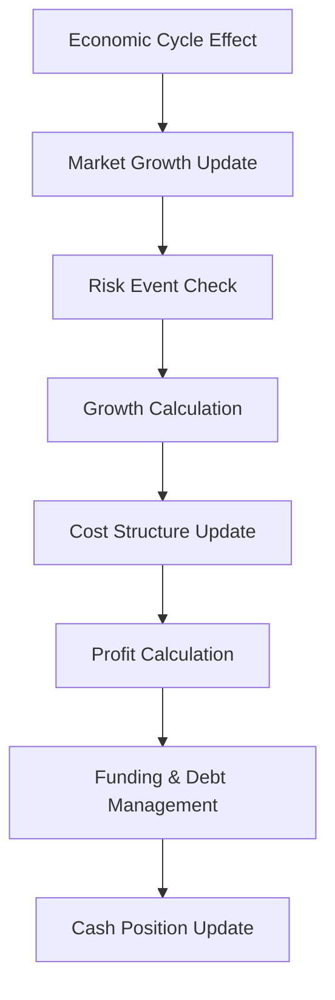

# Business Performance Simulation Framework Documentation

## 1. Overview
This Monte Carlo simulation framework models company performance under uncertainty, incorporating industry-specific dynamics, market conditions, and operational realities. The system generates multi-year financial projections while accounting for complex business interactions and risk factors.

## 2. Key Features
- **Customizable Parameters**: Industry verticals (SaaS/Manufacturing/Retail/Biotech), company maturity (startup/growth/established)
- **Dynamic Risk Modeling**: Competitor entry, regulatory changes, supply chain disruptions
- **Market Realism**: Economic cycles, seasonality patterns, market saturation effects
- **Financial Realism**: Debt management, funding rounds, cost inflation, R&D investment
- **Growth Dynamics**: S-curve adoption, customer retention impacts, employee scaling

## 3. Core Components

### 3.1 Company Configuration Engine (`generate_company_data`)
**Function:** Creates realistic company profiles using industry benchmarks

**Parameters:**
```python
industry_type: ("SaaS","Manufacturing","Retail","Biotech")
size: ("startup","growth","established") 
market_condition: ("boom","normal","recession")
```

**Key Metrics Configured:**
- Financial Structure: 
  - Revenue growth rate (mean: 6-25%, volatility: 5-20%)
  - Cost structure (variable: 30-70%, fixed: $800k-$4M base)
  - R&D (2-25%) and marketing (8-15%) allocations
- Market Dynamics:
  - Customer retention (70-95%)
  - Market growth (5-20%) with cyclicality (1-5)
  - Seasonality factors (0.05-0.25)
- Risk Profile:
  - Competitor entry probability (0.7-1.3x base)
  - Regulatory change risk (10-25%)
  - Supply chain risk (10-20%)

### 3.2 Simulation Engine (`run_monte_carlo_simulation`)
**Operational Flow:**
1. **Initialization**
   - Sets initial financial positions (revenue, cash, debt)
   - Calculates market size from initial market share
   - Configures growth S-curve parameters

2. **Quarterly Iteration:**


**Key Dynamics:**
- **Economic Cycles**: Sine wave modeling with configurable amplitude (20% variance)
- **Risk Events**:
  - *Competitor Entry*: Permanent market share loss (5-20%) + marketing cost surge
  - *Regulatory Changes*: Revenue impact (5-30%) + fixed cost increase
  - *Supply Chain Disruptions*: Temporary revenue loss (10-25%) + retention drop
- **Growth Modeling**:
  - Logistic S-curve: max_market_share = min(80%, 5x current)
  ```math
  s\_curve = \frac{1}{1 + e^{-0.5(t-10)}}
  ```
  - Customer-driven growth:
    ```python
    new_customers = base * (1 - market_share/max_share) * growth_rate
    ```

### 3.3 Financial Metrics Tracked
| Metric | Formula | Description |
|--------|---------|-------------|
| Revenue | `prev_rev * (1 + growth_rate + seasonality)` | Core income stream |
| Profit | `revenue - (fixed + variable + R&D + marketing)` | Operational profitability |
| Cash Flow | `profit + funding - debt_payment` | Liquidity position |
| ROI | `(profit / initial_investment) * 100` | Return on investment |
| Market Share | `(rev / market_size) * 100` | Competitive position |

## 4. Risk Modeling Details

### 4.1 Risk Event Probability Matrix
| Risk Type | Startup Prob | Growth Prob | Recession Impact |
|-----------|--------------|-------------|-------------------|
| Competitor Entry | 15-20% | 10-15% | +30% probability |
| Regulatory Change | 5-10% | 10-15% | +25% impact |
| Supply Chain | 10-15% | 15-20% | +40% duration |

### 4.2 Risk Mitigation Mechanisms
- **Debt Financing**: Available when cash < 0, terms based on credit score (650-820)
- **Cost Cutting**: Automatic 20% marketing cut + 30% R&D reduction
- **Emergency Funding**: 
  ```python
  if cash_runway < 3 and growth_rate > 0.1:
      raise_funding(valuation=rev * 4 * growth_rate)
  ```

## 5. Visualization System

### 5.1 Projection Charts
- **Time Series Plots** with 10-90% confidence bands
- Four Quadrant View:
  1. Revenue Trajectory
  2. Profit Evolution
  3. Cash Flow Waves
  4. ROI Development

### 5.2 Summary Dashboards
- **Profitability Probability**: Pie chart (Profitable/Unprofitable)
- **ROI Distribution**: Histogram with density curve
- **Risk Matrix**: Bankruptcy vs High Growth probabilities

## 6. Simulation Outputs

### 6.1 Key Performance Indicators
| KPI | Calculation | Benchmark |
|-----|-------------|-----------|
| Revenue CAGR | `(final_rev/initial_rev)^(1/years) - 1` | Industry 2x |
| Profit Margin | `mean(profit)/mean(revenue)` | >15% target |
| Cash Runway | `cash / abs(min(profit,0))` | >6 quarters |
| Risk-Adjusted ROI | `roi * (1 - bankruptcy_prob)` | >12% target |

### 6.2 Strategic Insights Generated
1. Growth Sustainability Analysis
2. Capital Requirement Forecasting
3. Risk Exposure Heatmaps
4. Scenario Comparison (Optimistic/Pessimistic)

## 7. Usage Scenarios

**7.1 Venture Capital Analysis**
- Evaluate startup viability across 10,000 scenarios
- Calculate probability of 10x return
- Assess optimal funding timing

**7.2 Corporate Strategic Planning**
- Model market entry strategies
- Test R&D investment levels
- Optimize debt/equity mix

**7.3 Operational Risk Management**
- Quantify supply chain buffers needed
- Size emergency credit facilities
- Plan headcount growth ceilings

## 8. Technical Implementation

**8.1 Dependencies**
- NumPy: Vectorized calculations
- Pandas: Data structure management
- Matplotlib/Seaborn: Visualization
- SciPy: Statistical functions

**8.2 Performance Characteristics**
- 10,000 iterations over 20 quarters: ~45s (M1 Mac)
- Memory usage: ~2GB RAM for full simulation
- Parallelization: Single-threaded implementation

## 9. Limitations & Future Development

**Current Constraints**
- North American market assumptions
- Linear employee cost modeling
- Simplified competitor interactions

**Roadmap Features**
- Geographic market segmentation
- AI-powered parameter tuning
- M&A scenario modeling
- Carbon impact forecasting
